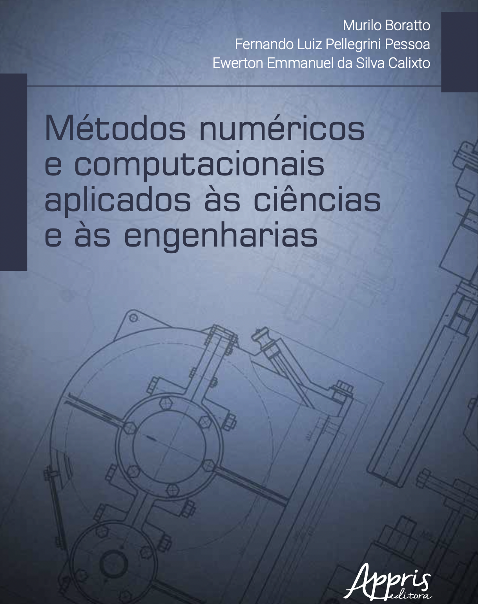

 

  

  <h3 align="center">Livro de Métodos Numéricos e Computacionais</h3>

  

    Aplicados às Ciências e às Engenharias
     
  

<!-- TABLE OF CONTENTS -->

  
Conteúdo

  <ol>
    <li>
      <a href="#link1">CONCEITOS BÁSICOS RELACIONADOS AOS MÉTODOS NUMÉRICOS</a>
    </li>
    <li>
      <a href="#link2">RESOLUÇÃO NUMÉRICA DE SISTEMAS DE EQUAÇÕES LINEARES</a> 
     <ul>
        <li><a href="#1">Resolução de Sistemas Triangulares</a></li>
        <li><a href="#2">Gauss Jordan</a></li>
        <li><a href="#2">Jacobi</a></li>
        <li><a href="#2">Gauss Siedel</a></li>
      </ul>
    </li>
    <li><a href="#link3">INTERPOLAÇÃO NUMÉRICA</a></li>
    <ul>
        <li><a href="#1">Lagrange</a></li>
        <li><a href="#2">Newton</a></li>
      </ul>
    <li><a href="#link4">ZEROS DA FUNÇÃO</a></li>
    <ul>
        <li><a href="#1">Bisseção</a></li>
        <li><a href="#2">Ponto Fixo</a></li>
        <li><a href="#2">Newthon Rapshon</a></li>
        <li><a href="#2">Secante</a></li>
      </ul>
    <li><a href="#link5">INTEGRAÇÃO NUMÉRICA</a></li>
      <ul>
        <li><a href="#1">Simpson</a></li>
        <li><a href="#2">Trapezios</a></li>
        <li><a href="#1">Gauss</a></li>        
      </ul>
    <li><a href="#link6">RESOLUÇÃO NUMÉRICA DE SISTEMAS DE EQUAÇÕES NÃO LINEARES</a></li>
      <ul>
        <li><a href="#1">Newthon Rapshon Modificado</a></li>
       </ul>
    <li><a href="#link7">RESOLUÇÃO NUMÉRICA DE EQUAÇÕES DIFERENCIAIS ORDINÁRIAS</a></li>
      <ul>
        <li><a href="#1">Euler</a></li>
        <li><a href="#2">Runger-Kutta</a></li>     
      </ul>
    <li><a href="#link8">PRINCÍPIOS DE OTIMIZAÇÃO</a></li>
      <ul>
        <li><a href="#1">5 pontos</a></li>
        <li><a href="#2">Dicótoma</a></li>
        <li><a href="#2">Fibonacci</a></li>
        <li><a href="#2">Secção Áurea</a></li>
      </ul>
  </ol>

<!-- ABOUT THE PROJECT -->
## Sobre este Livro

Ministrando disciplinas relacionadas a métodos numéricos ao longo de 10 anos, há pouco tempo algumas perguntas começaram a permear os meus pensamentos, por exemplo: “por que escrever um livro de métodos numéricos?”. Consequentemente vieram outras perguntas como: “por que escrever um livro de métodos numéricos sendo que já existem tantos?”. “Como seria possível escrever um livro de métodos numéricos diferente?”. E talvez a resposta estivesse no desejo de transmitir as experiências pessoais, na espera de que elas fossem úteis para alguém. Como as disciplinas relacionadas a métodos numéricos, em sua grande maioria, esquecem-se do esforço de vincu- lação dos conceitos teóricos à aplicação prática nas ciências aplicadas, este texto tem o orgulho de desmistificar uma visão “demasiadamente teórica” em detrimento da aplicabilidade desses conceitos.

Este livro-guia mescla minhas experiências nas disciplinas ministradas ao longo da minha docência universitária e das minhas práticas discentes experimentadas nos cursos de graduação e pós-graduação realizados durante a minha carreira acadêmica. Tentei apresentar um texto claro e objetivo, evitando sempre que possível a notação matemática carregada, na tentativa de generalizar o público alvo. Múltiplos exemplos de algoritmos foram incluídos nos capítulos a fim de permitir uma programação rápida dos métodos propostos. Compartilho com todos os estudantes, profissionais e pesquisadores das ciências exatas as diversas visões práticas dos métodos numéricos. A seguir alguns códigos fontes implementados nas diversas linguagens de programação (C/C++, matlab, python, ...) para as soluções de alguns exercícios contidos neste livro.

<!-- ACKNOWLEDGEMENTS -->
## Agradecimentos
* [Editora Appris](http://www.editoraappris.com.br)
* [Centro de Supercomputação para Inovação Industrial SENAI CIMATEC (CS2I)](http://www.fieb.org.br)
* [Universidade do Estado da Bahia (UNEB)](http://www.uneb.br)
